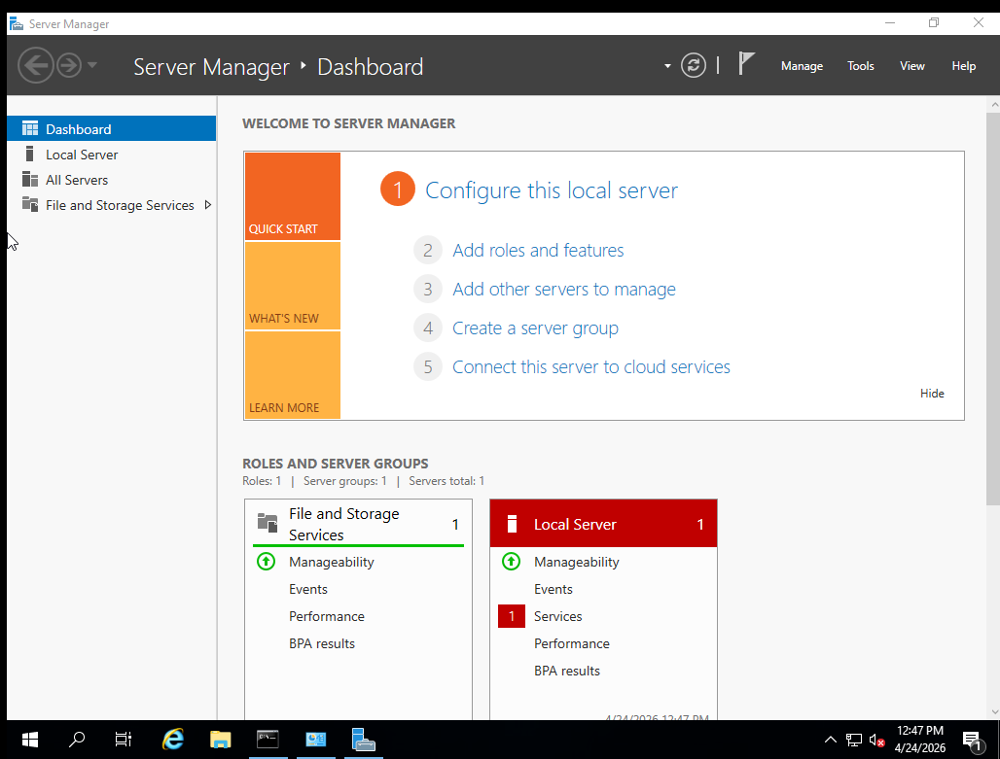
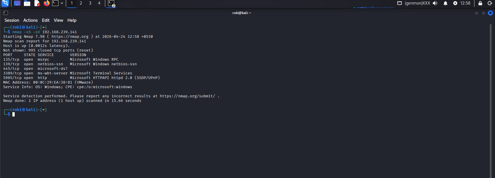

# 👨‍💻 Red Team Journey – Rohanth Nadendla

## 🎯 Goal

I am working towards becoming a Red Team Engineer with strong skills in offensive security, penetration testing, and real-world attack simulation.

## 📅 Start Date

April 2026

## 🛣️ Learning Roadmap

* Linux Fundamentals
* Networking Basics
* Web Exploitation (XSS, SQLi, SSRF, etc.)
* Privilege Escalation
* Active Directory Attacks
* Red Team Operations

## 📂 Repository Structure

* `/setup` – Lab setup and environment configuration
* `/linux` – Linux commands, labs, and notes
* `/networking` – Networking concepts and tools
* `/recon` – Information gathering techniques
* `/web` – Web vulnerabilities and practice
* `/exploitation` – Exploitation techniques
* `/writeups` – Lab reports and walkthroughs
* `/projects` – Tools and scripts I build

## 🚀 Progress

I update this repository daily with hands-on labs, notes, and real practice.
## 📅 Day 1-2 – Lab Setup Completed

### 🧱 Environment

* Windows Server 2019 (Target)
* Kali Linux (Attacker)

---

### 🔧 Tasks Done

* Installed Windows Server
* Installed Kali Linux
* Configured VM manually (disabled Easy Install)
* Fixed installation error (license issue)
* Connected both machines (NAT)

---

### 🔍 Recon (First Scan)

```bash
nmap -sS -sV -A <target-ip>
```

### 📌 Result

* Open ports discovered
* Services identified
* OS detection working

---

### ❌ Issue Faced

**Error:**
Windows cannot find Microsoft Software License Terms

**Fix:**

* Re-downloaded ISO
* Disabled Easy Install
* Increased RAM to 4GB
* Attached ISO manually

---

### 📸 Evidence






---

### 📚 Learning

* VM setup & troubleshooting
* Basic networking (IP, ping)
* Nmap scanning basics

---

### 🚀 Next

* Deep Nmap scanning
* Service enumeration
* Start vulnerability labs

## 📅 Progress Log

### Day 3-4
- Learned Linux command line basics
- Practiced file operations, process management, networking commands
- Created linux/cheatsheet.md
